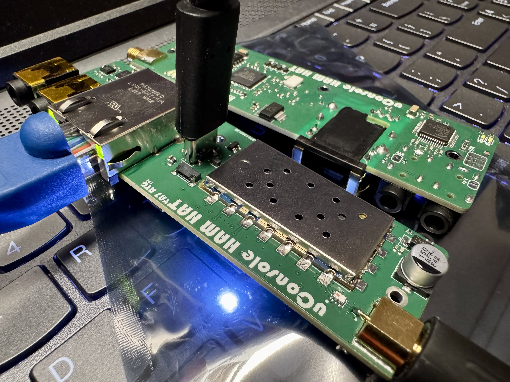

# uConsole HAM HAT

Hardware repository for the uConsole HAM HAT (SA818-based 2m radio board for uConsole).

Last updated: 2026-04-23

## Repo Split (Important)

The project is now split into two repositories:

- Hardware (this repo): PCB, CAD, manufacturing, bring-up, and hardware process docs.
- Software (moved): https://github.com/ayaghini/Ham-Radio-Hat-Software

If you are looking for Control Center app setup, APRS/comms workflows, or platform launch scripts, use the software repository.

## Current Hardware Status

- Rev03 is the active hardware baseline in this repo.
- Rev03 contains normalized project naming (`*_rev03.*`) and project-scoped library references.
- Board 3D links were converted to `${KIPRJMOD}` relative paths for portability.
- BOM and production files are present under the Rev03 production folder and continue to be finalized for repeatable manufacturing output.

## Repository Layout

- `PCB/`: KiCad projects and manufacturing outputs (`Rev00` to `Rev03`).
- `CAD/`: enclosure/mechanical assets.
- `Components/`: shared part libraries and symbols.
- `docs/`: architecture, operations, manufacturing, and archive docs.
- `Pictures/`: project photos and screenshots.
- `wiki/`: short index and pointers.

## Start Here

- Source-of-truth map: [docs/architecture/source-of-truth.md](docs/architecture/source-of-truth.md)
- Bring-up guide (hardware): [docs/operations/bring-up.md](docs/operations/bring-up.md)
- Manufacturing readiness history: [docs/manufacturing/rev02-readiness.md](docs/manufacturing/rev02-readiness.md)
- Software repository: https://github.com/ayaghini/Ham-Radio-Hat-Software

## First Batch and Contact

- First batch was received and function-checked on 2025-12-08.
- Interest in production batch: **va7ayg+uConsolehamhat [at] gmail [dot] com**
- Support page: https://www.patreon.com/c/VA7AYG

## Safety and Compliance

- Operate only on frequencies allowed by your license and jurisdiction.
- Use proper antenna/load and avoid uncontrolled transmissions during bench tests.
- Confirm local regulations before on-air testing.